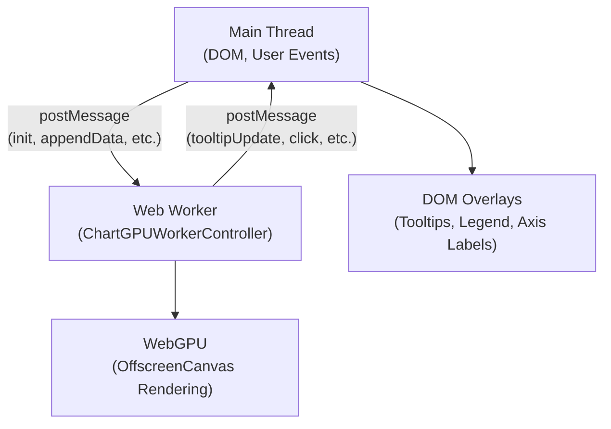
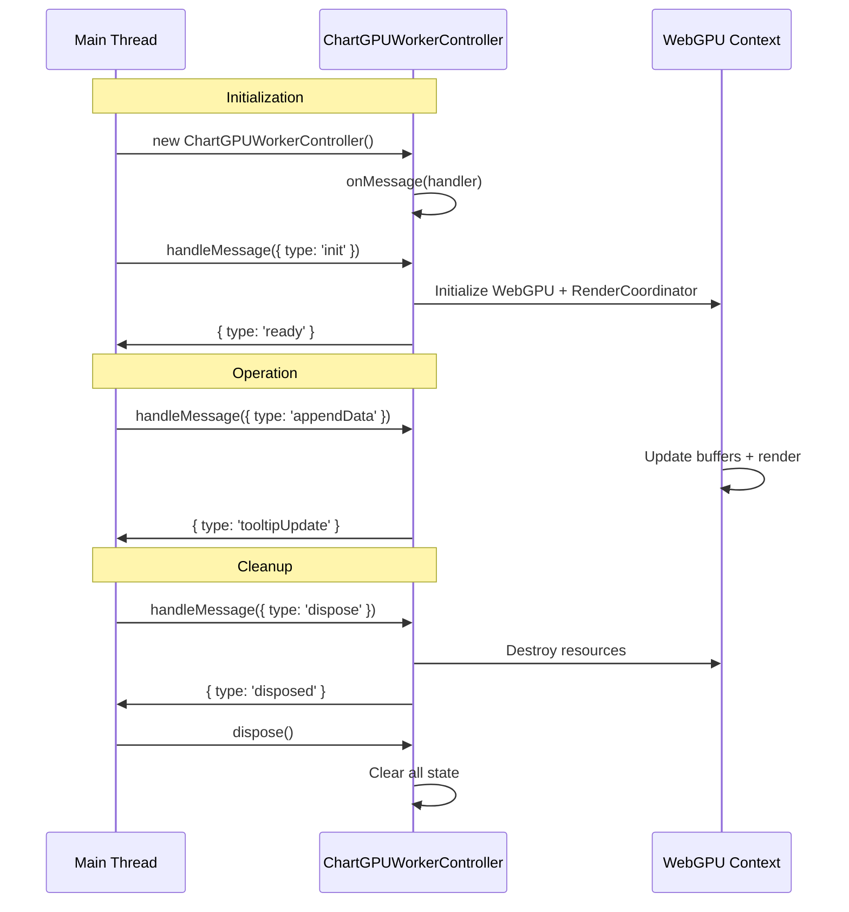

# Worker API

## Overview

The ChartGPU worker module provides a complete API for implementing GPU-accelerated chart rendering in Web Workers using OffscreenCanvas. This enables high-performance rendering without blocking the main thread, keeping your application responsive during intensive charting operations.

**Module:** `chartgpu/worker`

**Source:** [`src/worker/index.ts`](../../src/worker/index.ts), [`src/worker/createChartInWorker.ts`](../../src/worker/createChartInWorker.ts), [`src/worker/ChartGPUWorkerController.ts`](../../src/worker/ChartGPUWorkerController.ts)

**Related:** [Worker Communication Protocol](worker-protocol.md)

### Benefits

- **Main Thread Responsiveness:** GPU rendering runs in separate thread
- **Parallel Processing:** Chart computations don't compete with UI interactions
- **Zero-Copy Data Transfer:** ArrayBuffer and OffscreenCanvas transfer without cloning
- **Separation of Concerns:** GPU operations isolated from DOM manipulation

### Architecture



## Public API (Recommended)

The recommended way to create worker-based charts is via the high-level factory function or static method. These handle all worker setup, canvas transfer, and message coordination automatically.

**Source:** [`src/worker/createChartInWorker.ts`](../../src/worker/createChartInWorker.ts), [`src/worker/ChartGPUWorkerProxy.ts`](../../src/worker/ChartGPUWorkerProxy.ts)

### `createChartInWorker(container: HTMLElement, options: ChartGPUOptions, workerOrUrl?: Worker | string | URL): Promise<ChartGPUInstance>`

Factory function for creating worker-based chart instances with automatic setup.

**Parameters:**
- `container`: HTML element to attach canvas to (canvas will be created and appended automatically)
- `options`: Chart configuration (same as [`ChartGPU.create()`](chart.md#chartgpucreate))
- `workerOrUrl` (optional): Worker source - see [Worker Source Options](#worker-source-options)

**Returns:** Promise resolving to [`ChartGPUInstance`](chart.md#chartgpuinstance) proxy (same interface as main-thread charts)

**Throws:** `ChartGPUWorkerError` if:
- Container is invalid (not an HTMLElement)
- Worker creation or initialization fails
- Canvas creation or transfer fails
- Worker doesn't respond within 30s timeout

**Source:** [`src/worker/createChartInWorker.ts`](../../src/worker/createChartInWorker.ts)

### `ChartGPU.createInWorker(container: HTMLElement, options: ChartGPUOptions, workerOrUrl?: Worker | string | URL): Promise<ChartGPUInstance>`

Static method on `ChartGPU` namespace - **recommended entry point** for worker-based charts.

**Parameters:** Same as [`createChartInWorker()`](#createchartinworkercontainer-htmlelement-options-chartgpuoptions-workerorurl-worker--string--url-promisechartgpuinstance)

**Returns:** Same as [`createChartInWorker()`](#createchartinworkercontainer-htmlelement-options-chartgpuoptions-workerorurl-worker--string--url-promisechartgpuinstance)

**Note:** This is an alias for `createChartInWorker()` - identical behavior, more discoverable API.

**Source:** [`src/index.ts`](../../src/index.ts) exports `createChartInWorker` as `ChartGPU.createInWorker`

### Worker Source Options

The optional `workerOrUrl` parameter accepts three forms:

| Type | Behavior | Use Case |
|------|----------|----------|
| `undefined` | Use built-in worker (bundled) | Default - simplest option |
| `string \| URL` | Create worker from URL/path | Custom worker location or CDN |
| `Worker` | Use existing worker instance | Shared worker, pre-warmed worker |

**Built-in worker** (recommended):
- Worker bundled with library
- Automatically resolved by bundler
- No configuration needed

**Custom worker URL:**
- Provide path to custom worker script
- Must implement [ChartGPUWorkerController protocol](#chartgpuworkercontroller)
- Useful for CDN hosting or custom builds

**Existing worker instance:**
- Reuse worker across multiple charts
- Factory does NOT terminate worker on dispose (caller's responsibility)
- Useful for worker pooling

**Source:** [`createChartInWorker()` implementation](../../src/worker/createChartInWorker.ts)

### When to Use Worker-Based Charts

Choose worker-based rendering when:

**✅ Use Workers When:**
- Large datasets (>10K points) with frequent updates
- Real-time streaming data with high update rates
- Complex multi-series charts (>10 series)
- Application needs to remain responsive during chart updates
- Main thread is busy with other UI operations
- Mobile/low-power devices (offload work from main thread)

**❌ Use Main Thread When:**
- Small datasets (<1K points)
- Static or infrequently updated charts
- Simple single-series charts
- Worker overhead outweighs benefits
- Debugging or development (easier stack traces)
- Browser doesn't support OffscreenCanvas (Safari < 16.4, Firefox < 105)

**Performance Tradeoff:**
- Worker setup overhead: ~50-100ms (one-time)
- Message passing overhead: ~0.1-1ms per update
- Main thread blocking eliminated: priceless for large datasets

**Source:** See [Performance Documentation](../performance.md) for benchmarks

### `ChartGPUWorkerProxy`

Main-thread proxy class implementing `ChartGPUInstance` interface. Returned by `createChartInWorker()`.

**Interface:** Identical to [`ChartGPUInstance`](chart.md#chartgpuinstance) - use same methods and events

**Implementation Details:**
- **State Cache:** Maintains local copies of options, disposed, interactionX, zoomRange for synchronous getters
- **Message Correlation:** Unique message IDs track request/response pairs with 30s timeout
- **Event System:** Re-emits worker events (`click`, `mouseover`, `mouseout`, `crosshairMove`) to registered listeners
- **DOM Overlays:** Manages tooltip, legend, axis labels, and data zoom slider in main thread
- **Auto Resize:** Monitors container size and device pixel ratio changes, auto-resizes canvas
- **Event Forwarding:** Captures pointer and wheel events, forwards to worker for interaction handling

**Lifecycle:**
1. Constructor creates proxy with cached state
2. `init()` creates canvas, transfers to worker, waits for ready message
3. Methods send messages to worker, update local cache
4. `dispose()` cleans up overlays, terminates worker (if created by factory), removes canvas

**Source:** [`src/worker/ChartGPUWorkerProxy.ts`](../../src/worker/ChartGPUWorkerProxy.ts)

**Note:** Users don't typically construct this directly - use `createChartInWorker()` instead.

### Types

#### `WorkerConfig`

Configuration for `ChartGPUWorkerProxy` constructor (used internally by factory).

**Fields:**
- `worker: Worker`: Web Worker instance for rendering
- `chartId?: string`: Unique chart identifier (auto-generated if omitted)
- `messageTimeout?: number`: Timeout for async operations in ms (default: 30000)
- `gpuOptions?: { powerPreference?: 'low-power' | 'high-performance'; requiredFeatures?: ReadonlyArray<string> }`: WebGPU adapter options (optional)

**Source:** [`src/worker/types.ts`](../../src/worker/types.ts)

#### `ChartGPUWorkerError`

Error class for worker operations. Extends native `Error` with categorized error codes.

**Properties:**
- `code: string`: Error category code (see table below)
- `operation: string`: Operation that failed
- `chartId?: string`: Chart ID if available

**Error Codes:**
| Code | Description | Recovery |
|------|-------------|----------|
| `INVALID_ARGUMENT` | Invalid function argument | Fix call site |
| `WEBGPU_INIT_FAILED` | WebGPU/worker initialization failed | Check browser support |
| `DISPOSED` | Operation on disposed chart | Don't call after dispose |
| `TIMEOUT` | Operation timeout (30s default) | Check worker responsiveness |
| `COMMUNICATION_ERROR` | postMessage failed | Check message structure |
| `UNKNOWN` | Unclassified error | Log and report |

**Source:** [`src/worker/types.ts`](../../src/worker/types.ts)

## Low-Level API (Advanced)

The following sections document the low-level worker controller and protocol for advanced use cases. Most users should use the [Public API](#public-api-recommended) instead.

### When to Use Low-Level API

Use the low-level worker controller when:
- Implementing custom worker communication patterns
- Integrating with existing worker infrastructure
- Building abstractions on top of ChartGPU
- Fine-grained control over message flow

For standard use cases, prefer the [high-level factory function](#createchartinworker).

## Quick Start (Low-Level)

### Worker Setup

**Worker entry point** (`worker.ts`):

```typescript
import { ChartGPUWorkerController } from 'chartgpu/worker';

const controller = new ChartGPUWorkerController();

controller.onMessage((msg) => {
  self.postMessage(msg);
});

self.onmessage = async (event) => {
  await controller.handleMessage(event.data);
};
```

### Main Thread Setup

**Main thread** (`main.ts`):

```typescript
import type { WorkerInboundMessage, WorkerOutboundMessage } from 'chartgpu/worker';

const worker = new Worker(new URL('./worker.ts', import.meta.url));
const canvas = document.querySelector('canvas');
const offscreen = canvas.transferControlToOffscreen();

// Send init message
const initMsg: WorkerInboundMessage = {
  type: 'init',
  chartId: 'chart-1',
  messageId: crypto.randomUUID(),
  canvas: offscreen,
  devicePixelRatio: window.devicePixelRatio,
  options: {
    series: [{ type: 'line', data: [[0, 1], [1, 2]] }]
  }
};

worker.postMessage(initMsg, [offscreen]);

// Handle worker responses
worker.onmessage = (event) => {
  const msg: WorkerOutboundMessage = event.data;
  if (msg.type === 'ready') {
    console.log('Chart initialized');
  } else if (msg.type === 'tooltipUpdate') {
    // Render tooltip in DOM
  }
};
```

**Source:** See complete implementation guide in [Worker Thread Integration](../internal/WORKER_THREAD_INTEGRATION.md)

## ChartGPUWorkerController

Main controller class for managing chart instances in a Web Worker. Handles message routing, GPU context initialization, and resource lifecycle.

**Source:** [`src/worker/ChartGPUWorkerController.ts`](../../src/worker/ChartGPUWorkerController.ts)

### `new ChartGPUWorkerController()`

Creates a new worker controller instance. Typically instantiated once per worker.

**Returns:** `ChartGPUWorkerController` instance

**Note:** Controller can manage multiple chart instances (identified by `chartId`).

### Instance Methods

#### `onMessage(handler: (msg: WorkerOutboundMessage) => void): void`

Registers a callback to receive outbound messages for sending to the main thread.

**Parameters:**
- `handler`: Function called when controller emits messages to main thread

**When to call:** Immediately after constructing the controller, before processing any messages

**Source:** See [`WorkerOutboundMessage`](worker-protocol.md#outbound-messages-worker--main) for all message types

#### `async handleMessage(msg: WorkerInboundMessage): Promise<void>`

Main entry point for processing inbound messages from the main thread.

**Parameters:**
- `msg`: Inbound message from main thread

**Returns:** Promise that resolves when message processing completes

**Error Handling:** Catches all errors and emits `error` message to main thread. Safe to call without try/catch.

**Message Types:** See [`WorkerInboundMessage`](worker-protocol.md#inbound-messages-main--worker) for all supported messages

**Source:** [`ChartGPUWorkerController.handleMessage()`](../../src/worker/ChartGPUWorkerController.ts)

#### `dispose(): void`

Disposes all chart instances and cleans up controller resources.

**When to call:** Before terminating the worker (in response to worker shutdown signal)

**Effects:**
- Disposes all active chart instances
- Destroys GPU contexts
- Cleans up render loops
- Removes message handler

**Note:** After calling `dispose()`, do not send additional messages to the worker.

**Source:** [`ChartGPUWorkerController.dispose()`](../../src/worker/ChartGPUWorkerController.ts)

### Lifecycle



## Protocol Types

All message types are exported from `chartgpu/worker` for type safety in both main and worker threads.

### Inbound Messages (Main → Worker)

Messages sent from main thread to worker thread:

| Type | Description | Documentation |
|------|-------------|---------------|
| `InitMessage` | Initialize chart with OffscreenCanvas | [init](worker-protocol.md#init) |
| `SetOptionMessage` | Update chart configuration | [setOption](worker-protocol.md#setoption) |
| `AppendDataMessage` | Append data to single series | [appendData](worker-protocol.md#appenddata) |
| `AppendDataBatchMessage` | Batch append to multiple series | [appendDataBatch](worker-protocol.md#appenddatabatch) |
| `ResizeMessage` | Update canvas dimensions | [resize](worker-protocol.md#resize) |
| `ForwardPointerEventMessage` | Forward pointer interaction | [forwardPointerEvent](worker-protocol.md#forwardpointerevent) |
| `SetZoomRangeMessage` | Set zoom window programmatically | [setZoomRange](worker-protocol.md#setzoomrange) |
| `SetInteractionXMessage` | Set crosshair position | [setInteractionX](worker-protocol.md#setinteractionx) |
| `SetAnimationMessage` | Configure animation | [setAnimation](worker-protocol.md#setanimation) |
| `DisposeMessage` | Clean up chart resources | [dispose](worker-protocol.md#dispose) |

**Union Type:** `WorkerInboundMessage` (discriminated union of all inbound message types)

**Source:** [`src/worker/protocol.ts`](../../src/worker/protocol.ts)

### Outbound Messages (Worker → Main)

Messages emitted by worker thread:

| Type | Description | Documentation |
|------|-------------|---------------|
| `ReadyMessage` | Initialization complete | [ready](worker-protocol.md#ready) |
| `RenderedMessage` | Frame render complete | [rendered](worker-protocol.md#rendered) |
| `TooltipUpdateMessage` | Tooltip data changed | [tooltipUpdate](worker-protocol.md#tooltipupdate) |
| `LegendUpdateMessage` | Legend items changed | [legendUpdate](worker-protocol.md#legendupdate) |
| `AxisLabelsUpdateMessage` | Axis labels changed | [axisLabelsUpdate](worker-protocol.md#axislabelsupdate) |
| `HoverChangeMessage` | Hover state changed | [hoverChange](worker-protocol.md#hoverchange) |
| `ClickMessage` | Click detected on data point | [click](worker-protocol.md#click) |
| `CrosshairMoveMessage` | Crosshair position changed | [crosshairMove](worker-protocol.md#crosshairmove) |
| `ZoomChangeMessage` | Zoom range changed | [zoomChange](worker-protocol.md#zoomchange) |
| `DeviceLostMessage` | GPU device lost | [deviceLost](worker-protocol.md#devicelost) |
| `DisposedMessage` | Disposal complete | [disposed](worker-protocol.md#disposed) |
| `ErrorMessage` | Operation failed | [error](worker-protocol.md#error) |

**Union Type:** `WorkerOutboundMessage` (discriminated union of all outbound message types)

**Source:** [`src/worker/protocol.ts`](../../src/worker/protocol.ts)

### Event Payload

**Type:** `WorkerEventPayload`

Worker event data for hover and click events. Cannot include native `PointerEvent` (not cloneable for postMessage).

**Fields:**
- `seriesIndex: number`: Index of the series
- `dataIndex: number`: Index of the data point within the series
- `value: readonly [number, number] | readonly [number, number, number, number, number]`: Data point value (DataPoint or OHLCDataPoint)
- `x: number`: CSS pixel x coordinate
- `y: number`: CSS pixel y coordinate

**Source:** [`src/worker/protocol.ts`](../../src/worker/protocol.ts)

## Utility Functions

### `getTransferables(msg: WorkerInboundMessage): readonly Transferable[]`

Extracts transferable objects from an inbound message for efficient postMessage.

**Parameters:**
- `msg`: Inbound message to extract transferables from

**Returns:** Array of objects that should be transferred (zero-copy) rather than cloned

**Transferable Types:**
- `OffscreenCanvas`: Graphics rendering context (from `init`)
- `ArrayBuffer`: Binary data buffers (from `appendData`, `appendDataBatch`)

**Usage:** Call with message before posting: `worker.postMessage(msg, getTransferables(msg))`

**Performance:** Transferring objects is zero-copy and much faster than cloning for large buffers.

**Important:** Transferred objects become unusable in the sender thread. Clone data if sender needs to retain it.

**Source:** [`src/worker/protocol.ts`](../../src/worker/protocol.ts)

## Re-exported Types

The worker module re-exports commonly used types from the main library for convenience:

| Type | Description | Source |
|------|-------------|--------|
| `ChartGPUOptions` | Chart configuration options | [`src/config/types.ts`](../../src/config/types.ts) |
| `AnimationConfig` | Animation configuration | [`src/config/types.ts`](../../src/config/types.ts) |
| `PointerEventData` | Pre-computed pointer event data | [`src/config/types.ts`](../../src/config/types.ts) |
| `TooltipData` | Tooltip content and position | [`src/config/types.ts`](../../src/config/types.ts) |
| `LegendItem` | Legend entry data | [`src/config/types.ts`](../../src/config/types.ts) |
| `AxisLabel` | Axis tick label data | [`src/config/types.ts`](../../src/config/types.ts) |

**Usage:** Import directly from `chartgpu/worker` instead of main library.

## Error Handling

The worker controller provides comprehensive error handling with categorized error codes.

### Error Codes

| Code | Description | Recovery Strategy |
|------|-------------|------------------|
| `WEBGPU_INIT_FAILED` | WebGPU initialization failed | Check browser support, show fallback UI |
| `DEVICE_LOST` | GPU device lost during operation | Terminate and recreate worker |
| `RENDER_ERROR` | Error during render pass | Log error, check GPU state, consider restart |
| `DATA_ERROR` | Invalid data format or buffer | Validate data format, check stride values |
| `UNKNOWN` | Unclassified error | Log error, consider worker restart |

**Source:** See [`ErrorMessage`](worker-protocol.md#error) for error message format

### Device Loss

GPU devices can be lost due to driver crashes, timeouts, or system events:

1. Worker emits `deviceLost` message with reason
2. Worker becomes non-functional (cannot render)
3. Main thread should terminate worker and recreate if needed
4. **Do not** send `dispose` message after `deviceLost` (automatic cleanup)

**Source:** [Worker Protocol - Device Loss](worker-protocol.md#device-loss-handling)

## Performance Considerations

The worker controller includes several performance optimizations:

### Shared State Closures

Chart state is captured in coordinator callbacks to eliminate Map lookups in hot paths (60fps render loop).

### Cached Render Loop

Render callback caches coordinator references to avoid lookups on every frame.

### Optimized Deserialization

Data deserialization uses pre-allocated arrays and unrolled loops for streaming performance.

### Zero-Copy Transfers

ArrayBuffers are transferred (not cloned) via postMessage, eliminating serialization overhead for large datasets.

### Batch Operations

`appendDataBatch` validates all items upfront and defers render until all appends complete.

**Source:** See [`ChartGPUWorkerController` implementation](../../src/worker/ChartGPUWorkerController.ts) for detailed comments

## Multi-Chart Support

A single worker controller can manage multiple chart instances:

**Pattern:**
- Each chart has unique `chartId` string
- All messages include `chartId` for routing
- Worker maintains separate GPU context per chart
- Independent render loops per chart

**Usage:**
```typescript
// Main thread creates multiple charts in same worker
worker.postMessage({ type: 'init', chartId: 'chart-1', ... });
worker.postMessage({ type: 'init', chartId: 'chart-2', ... });

// Updates are routed by chartId
worker.postMessage({ type: 'appendData', chartId: 'chart-1', ... });
worker.postMessage({ type: 'appendData', chartId: 'chart-2', ... });
```

**Note:** Multiple charts share worker thread CPU time. For optimal performance, limit to 2-4 charts per worker.

## Related Documentation

- [Worker Communication Protocol](worker-protocol.md) - Detailed message format specifications
- [Worker Thread Integration Guide](../internal/WORKER_THREAD_INTEGRATION.md) - Complete implementation guide
- [RenderCoordinator](INTERNALS.md#worker-thread-support--dom-overlay-separation) - Internal coordinator implementation
- [PointerEventData](interaction.md#pointereventdata) - Pointer event format
- [Event Handling](interaction.md#event-handling) - Chart interaction events
- [Chart Options](options.md) - Configuration reference

## Summary

The ChartGPU worker API provides a complete, type-safe interface for implementing worker-based chart rendering:

- **`ChartGPUWorkerController`**: Main controller class for managing chart instances
- **Protocol Types**: Type-safe message definitions for main ↔ worker communication
- **Utilities**: Helper functions like `getTransferables()` for efficient data transfer
- **Performance**: Zero-copy transfers, cached lookups, optimized deserialization
- **Multi-Chart**: Single worker can manage multiple chart instances
- **Error Handling**: Comprehensive error categorization with recovery strategies

For protocol message specifications, see [Worker Communication Protocol](worker-protocol.md).

For implementation examples and best practices, see the [Worker Thread Integration Guide](../internal/WORKER_THREAD_INTEGRATION.md).
