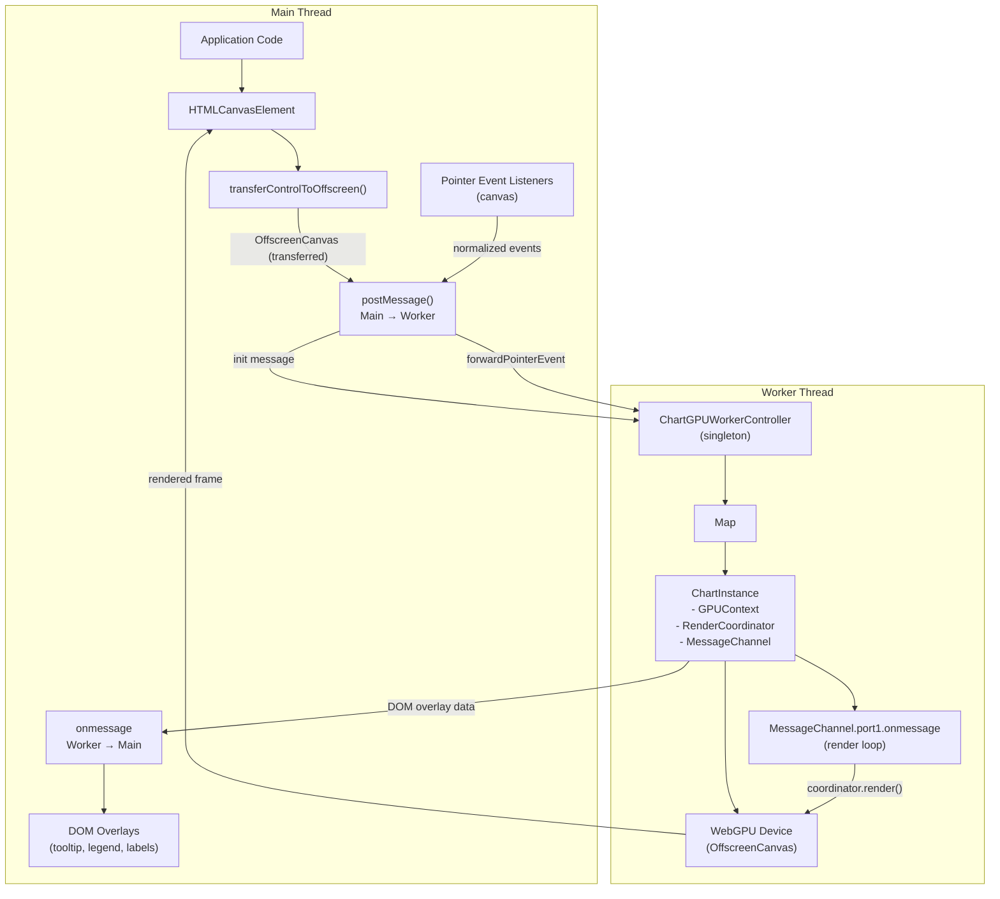

# ChartGPU Worker Thread Architecture

## Overview

ChartGPU's worker thread system offloads GPU rendering to a Web Worker, keeping the main thread responsive during intensive rendering operations. The architecture separates GPU operations (worker thread) from DOM overlays (main thread) using a message-based protocol with OffscreenCanvas.

**Key benefits:**
- Main thread remains responsive during GPU compute and rendering
- Parallel processing of render computations on separate thread
- Clean separation of WebGPU operations from DOM manipulation
- Support for multiple chart instances in a single worker

**Source files:**
- Worker controller: [`src/worker/ChartGPUWorkerController.ts`](../../src/worker/ChartGPUWorkerController.ts)
- Message protocol: [`src/worker/protocol.ts`](../../src/worker/protocol.ts)
- Worker entrypoint: [`src/worker/index.ts`](../../src/worker/index.ts)

## Why Workers for ChartGPU?

### Main Thread Responsiveness

Traditional canvas rendering blocks the main thread during draw operations. For high-frequency streaming data (e.g., 1000+ points/second), this causes:
- UI freezes and janky scrolling
- Delayed user input response
- Dropped animation frames
- Poor user experience

Worker threads solve this by:
- Moving GPU operations off the main thread
- Processing render requests asynchronously
- Allowing UI interactions to proceed without blocking
- Maintaining 60fps main thread performance

### WebGPU Suitability

WebGPU is particularly well-suited for worker threads:
- OffscreenCanvas provides GPU context in worker
- CommandEncoder/Queue operations are non-blocking
- GPU device can be accessed from any thread
- Render passes submit asynchronously to GPU

### Performance Characteristics

**Main thread rendering:**
- Render time: 1-5ms per frame (blocks main thread)
- UI responsiveness: Degraded during rendering
- Best for: Static charts, infrequent updates

**Worker thread rendering:**
- Message overhead: ~0.1ms per message
- UI responsiveness: Excellent (main thread unblocked)
- Best for: Real-time streaming, high-frequency updates

## Architecture Diagram

## Message Flow

### Initialization Sequence

1. **Main thread:** Create HTMLCanvasElement and mount to DOM
2. **Main thread:** Transfer canvas control via `transferControlToOffscreen()`
3. **Main thread:** Create Web Worker and post `init` message with OffscreenCanvas
4. **Worker thread:** Receive `init` message in `ChartGPUWorkerController`
5. **Worker thread:** Initialize WebGPU context via [`createGPUContext()`](../../src/core/GPUContext.ts)
6. **Worker thread:** Create [`RenderCoordinator`](../../src/core/createRenderCoordinator.ts) with `domOverlays: false`
7. **Worker thread:** Set up MessageChannel for render scheduling
8. **Worker thread:** Emit `ready` message to main thread
9. **Main thread:** Receive `ready` message and begin sending configuration/data

**Source:** See [`ChartGPUWorkerController.initChart()`](../../src/worker/ChartGPUWorkerController.ts)

### Configuration and Data Updates

**Pattern:** Main thread sends configuration messages, worker applies changes and requests render

**Common messages:**
- `setOption`: Update chart configuration (series, axes, theme)
- `appendData`: Append new data points to a series (streaming)
- `appendDataBatch`: Batch append to multiple series
- `resize`: Update canvas dimensions

**Render triggering:**
- Configuration changes trigger `coordinator.setOptions()` which calls `onRequestRender()` callback
- Data appends trigger `coordinator.appendData()` which calls `onRequestRender()` callback
- Callbacks post message to MessageChannel, scheduling render

**Source:** See [`ChartGPUWorkerController.handleSetOption()`](../../src/worker/ChartGPUWorkerController.ts) and [`ChartGPUWorkerController.handleAppendData()`](../../src/worker/ChartGPUWorkerController.ts)

### Interaction Flow

**Pattern:** Main thread captures DOM events, computes grid coordinates, forwards to worker

1. **Main thread:** Pointer event fires on canvas
2. **Main thread:** Compute grid coordinates using `getBoundingClientRect()` and `GridArea` margins
3. **Main thread:** Normalize to [`PointerEventData`](../../src/config/types.ts) structure
4. **Main thread:** Post `forwardPointerEvent` message to worker
5. **Worker thread:** Receive event in `handlePointerEvent()`
6. **Worker thread:** Pass to [`coordinator.handlePointerEvent()`](../../src/core/createRenderCoordinator.ts)
7. **Worker thread:** Coordinator performs hit testing and updates interaction state
8. **Worker thread:** Emit interaction messages to main thread:
   - `tooltipUpdate`: Tooltip content and position
   - `hoverChange`: Hover state changed
   - `click`: Click with hit test results
   - `crosshairMove`: Crosshair position
9. **Main thread:** Receive messages and update DOM overlays

**Source:** See [`ChartGPUWorkerController.handlePointerEvent()`](../../src/worker/ChartGPUWorkerController.ts) and [INTERNALS.md - Worker Thread Support](../api/INTERNALS.md#worker-thread-support--dom-overlay-separation)

### DOM Overlay Updates

**Pattern:** Worker computes overlay data, main thread renders DOM elements

**Overlay types:**
- **Tooltip:** Hover feedback with data point info
- **Legend:** Series names and colors
- **Axis labels:** Tick values and axis titles
- **Crosshair:** Synchronized crosshair across charts

**Update triggers:**
- Tooltip: Pointer movement, hover state changes
- Legend: Series configuration changes, theme changes
- Axis labels: Zoom/pan, data updates, axis config changes
- Crosshair: Pointer movement, `setInteractionX()` calls

**Callback implementation:**
- Worker: RenderCoordinator callbacks emit messages via `ChartGPUWorkerController.emit()`
- Main thread: Message handler receives and routes to DOM rendering functions

**Source:** See [RenderCoordinatorCallbacks](../api/INTERNALS.md#rendercoordinatorcallbacks) and [INTERNALS.md - Worker Thread Support](../api/INTERNALS.md#worker-thread-support--dom-overlay-separation)

## Render Scheduling with MessageChannel

### Why MessageChannel Instead of requestAnimationFrame?

Workers don't have access to `requestAnimationFrame()` (DOM API). ChartGPU uses **MessageChannel** for render scheduling instead:

**MessageChannel benefits:**
- Available in worker context (no DOM dependency)
- Event-driven scheduling (trigger render on demand)
- Coalesces multiple render requests automatically
- No timing issues with RAF synchronization

**Pattern:**
1. Configuration/data changes trigger `onRequestRender()` callback
2. Callback checks if render is already pending
3. If not pending, set `renderPending = true` and post message to MessageChannel
4. MessageChannel.port1.onmessage handler receives message
5. Handler resets `renderPending = false` and calls `coordinator.render()`
6. Render executes GPU operations and submits command buffer

**Source:** See [`ChartGPUWorkerController.initChart()`](../../src/worker/ChartGPUWorkerController.ts) lines 286-289 (callback) and lines 444-461 (render loop)

### Render Coalescing

**Problem:** Multiple rapid updates (e.g., batch data append + resize + theme change) should render once, not three times.

**Solution:** `renderPending` flag in `ChartInstanceState`

**Mechanism:**
1. First update sets `renderPending = true` and posts to MessageChannel
2. Subsequent updates check `renderPending` and skip posting if true
3. MessageChannel ensures only one message is processed at a time
4. Render resets `renderPending = false` after completion
5. Next update can schedule new render

**Performance benefit:** Eliminates redundant render passes, critical for high-frequency updates

**Source:** See [`ChartGPUWorkerController.initChart()`](../../src/worker/ChartGPUWorkerController.ts) onRequestRender callback

### Render Loop Protection

**Critical checks before render:**
1. **Disposed check:** Skip if `state.disposed === true`
2. **Device lost check:** Skip if `state.deviceLost === true`
3. **Try-catch:** Catch render errors and emit `error` message

**Source:** See [`ChartGPUWorkerController.initChart()`](../../src/worker/ChartGPUWorkerController.ts) render loop handler

## Device Loss Handling Strategy

### Why Device Loss Occurs

GPU devices can be lost due to:
- Driver crashes or timeouts
- GPU removed/reset (laptop dock/undock)
- System power management
- Explicit `device.destroy()` calls
- Out-of-memory conditions

**Impact:** All GPU resources become invalid, rendering stops

### Detection and Monitoring

**Two monitoring points:**

1. **Early monitoring (initialization):** Set up `device.lost` promise listener immediately after `initializeGPUContext()`
   - Catches device loss during coordinator creation
   - Emits `deviceLost` message with initialization context

2. **Runtime monitoring (coordinator):** Coordinator sets up `device.lost` listener in `onDeviceLost` callback
   - Catches device loss during normal operation
   - Emits `deviceLost` message via callback

**Source:** See [`ChartGPUWorkerController.initChart()`](../../src/worker/ChartGPUWorkerController.ts) lines 238-249 (early) and lines 413-421 (coordinator callback)

### State Tracking

**ChartInstanceState.deviceLost flag:**
- Set to `true` when device loss detected
- Checked before all GPU operations (resize, render, data upload)
- Prevents operations on lost devices (throws clear errors)

**Render loop behavior:**
- Checks `deviceLost` flag before rendering
- Silently skips render if device lost
- Resets `renderPending` flag to prevent queue buildup

**Source:** See [`ChartGPUWorkerController.initChart()`](../../src/worker/ChartGPUWorkerController.ts) render loop handler

### Recovery Strategy

**Current behavior:** No automatic recovery

**Rationale:**
- Device loss is rare in production
- Recovery requires complete state reconstruction
- Main thread is better positioned to handle recovery (has application state)

**Recommended recovery pattern (main thread):**
1. Listen for `deviceLost` message
2. Display user notification
3. Terminate worker via `worker.terminate()`
4. Recreate worker and reinitialize chart
5. Restore data and configuration from application state

**Source:** See [worker-protocol.md - Device Loss Handling](../api/worker-protocol.md#device-loss-handling)

### Error Handling

**GPU validation errors:** Captured via `device.addEventListener('uncapturederror')`
- Distinguishes validation errors vs. out-of-memory errors
- Emits detailed error message to main thread
- Continues operation (validation errors are warnings in WebGPU)

**Source:** See [`ChartGPUWorkerController.initChart()`](../../src/worker/ChartGPUWorkerController.ts) lines 251-259

## Multi-Chart Support in Single Worker

### Architecture

**Single worker, multiple chart instances:**
- One `ChartGPUWorkerController` singleton per worker
- Controller manages `Map<chartId, ChartInstance>`
- Each instance has independent GPU context, coordinator, and render channel

**Benefits:**
- Reduced worker overhead (one worker thread, not N threads)
- Shared GPU device across charts (better resource utilization)
- Simplified lifecycle management

**Source:** See [`ChartGPUWorkerController`](../../src/worker/ChartGPUWorkerController.ts) class definition

### Chart Instance Isolation

**ChartInstance structure:**
- `chartId`: Unique identifier (provided by main thread)
- `gpuContext`: [`GPUContextState`](../../src/core/GPUContext.ts) (independent GPU device)
- `coordinator`: [`RenderCoordinator`](../../src/core/createRenderCoordinator.ts) (independent render state)
- `canvas`: `OffscreenCanvas` (transferred from main thread)
- `renderChannel`: `MessageChannel` (independent render loop)
- `state`: `ChartInstanceState` (disposed, deviceLost, renderPending flags)

**Independence guarantees:**
- Each chart has separate GPU device (device loss affects only one chart)
- Each chart has separate render channel (no render interference)
- Each chart has separate state (dispose/device loss tracked independently)

**Source:** See [`ChartInstance`](../../src/worker/ChartGPUWorkerController.ts) interface

### Message Routing

**Pattern:** All messages include `chartId` field

**Routing mechanism:**
1. Worker receives message via `onmessage`
2. `ChartGPUWorkerController.handleMessage()` extracts `chartId`
3. Controller looks up instance in map via `getChartInstance(chartId)`
4. Handler performs operation on specific instance
5. Emitted messages include `chartId` for main thread routing

**Error handling:**
- Chart not found: Emit error message with `chartId`
- Chart disposed: Emit error message with clear description
- Chart device lost: Emit error message suggesting re-initialization

**Source:** See [`ChartGPUWorkerController.handleMessage()`](../../src/worker/ChartGPUWorkerController.ts) and [`ChartGPUWorkerController.getChartInstance()`](../../src/worker/ChartGPUWorkerController.ts)

### Resource Isolation

**Per-chart GPU resources:**
- GPU device (created per-chart via `createGPUContext()`)
- Render pipelines (created per-series in coordinator)
- GPU buffers (created per-series in data store)
- Command encoders/queues (per-device)

**Cleanup isolation:**
- `dispose(chartId)`: Cleans up only specified chart
- Other charts continue operating
- No shared state between chart instances

**Source:** See [`ChartGPUWorkerController.disposeChart()`](../../src/worker/ChartGPUWorkerController.ts)

## Resource Lifecycle and Cleanup

### Initialization Phase

**Resource creation order:**
1. **OffscreenCanvas:** Transferred from main thread in `init` message
2. **GPUContext:** Created via [`createGPUContext()`](../../src/core/GPUContext.ts) and initialized via [`initializeGPUContext()`](../../src/core/GPUContext.ts)
3. **MessageChannel:** Created for render scheduling
4. **RenderCoordinator:** Created with GPU context and callbacks
5. **DataStore:** Created internally by coordinator for GPU buffer management
6. **Renderers:** Created per-series by coordinator

**Error handling:** If initialization fails, MessageChannel is closed and error message emitted

**Source:** See [`ChartGPUWorkerController.initChart()`](../../src/worker/ChartGPUWorkerController.ts)

### Runtime Phase

**Resource lifetime:**
- GPU buffers managed by [`createDataStore()`](../../src/data/createDataStore.ts)
- Buffers grow geometrically on data updates
- Renderers persist until series configuration changes
- GPU device remains active until dispose or device loss

**Source:** See [INTERNALS.md - GPU buffer streaming](../api/INTERNALS.md#gpu-buffer-streaming-internal--contributor-notes)

### Cleanup Phase

**Resource destruction order:**
1. **Mark disposed:** Set `state.disposed = true` (prevents new operations)
2. **Close MessageChannel:** Close both ports to stop render loop
3. **Dispose coordinator:** Calls `coordinator.dispose()`
   - Destroys all GPU buffers via `dataStore.dispose()`
   - Destroys all renderer pipelines
   - Cleans up interaction state
4. **Destroy GPU context:** Calls [`destroyGPUContext()`](../../src/core/GPUContext.ts)
   - Calls `device.destroy()` with error handling
   - Resets context state
5. **Remove from registry:** Delete from `charts` map
6. **Emit disposed message:** Notify main thread with any cleanup errors

**Best-effort cleanup:** Non-fatal errors are collected and reported in `disposed` message

**Source:** See [`ChartGPUWorkerController.disposeChart()`](../../src/worker/ChartGPUWorkerController.ts)

### Memory Leak Prevention

**Critical cleanup patterns:**
- Always close MessageChannel ports (prevents event listener leaks)
- Always destroy GPU buffers (prevents GPU memory leaks)
- Always call `device.destroy()` (releases GPU resources)
- Remove chart from map (prevents memory retention)

**Double-dispose protection:** Attempting to dispose an already-disposed chart emits error and returns early

**Source:** See [`ChartGPUWorkerController.disposeChart()`](../../src/worker/ChartGPUWorkerController.ts)

## Error Handling Strategy

### Error Categories

| Error Code | Description | Recovery Strategy |
|------------|-------------|-------------------|
| `WEBGPU_INIT_FAILED` | WebGPU adapter/device request failed | Check browser support, show fallback UI |
| `DEVICE_LOST` | GPU device lost during operation | Terminate and recreate worker |
| `RENDER_ERROR` | Error during render pass | Log error, check GPU state, consider restart |
| `DATA_ERROR` | Data processing or buffer operation failed | Validate data format and retry |
| `UNKNOWN` | Unclassified error | Log error, consider worker restart |

**Source:** See [`ErrorMessage`](../../src/worker/protocol.ts) type definition

### Error Message Structure

**All errors include:**
- `chartId`: Affected chart identifier
- `code`: Error category for programmatic handling
- `message`: Human-readable description
- `operation`: Operation that failed (e.g., 'init', 'render', 'appendData')
- `stack`: Optional stack trace for debugging
- `messageId`: Optional ID to correlate with specific request

**Source:** See [`ChartGPUWorkerController.emitError()`](../../src/worker/ChartGPUWorkerController.ts)

### Error Handling Patterns

**Validation errors:** Thrown synchronously with descriptive messages
- Parameter validation (seriesIndex, pointCount, dimensions, etc.)
- Buffer size validation (stride, byte length)
- Zoom range validation (bounds, ordering)

**Runtime errors:** Caught and emitted as error messages
- Render errors caught in render loop handler
- Device loss detected via promise and callbacks
- GPU validation errors captured via `uncapturederror` listener

**Cleanup errors:** Collected but don't fail dispose operation
- Best-effort cleanup continues even if individual steps fail
- Errors reported in `disposed` message `cleanupErrors` array

**Source:** See [`ChartGPUWorkerController`](../../src/worker/ChartGPUWorkerController.ts) error handling throughout

## Performance Optimizations

### Shared State Closures

**Problem:** Map lookups in hot paths (onRequestRender called on every data update at 60fps)

**Solution:** Capture `ChartInstanceState` in coordinator callbacks

**Benefit:** Eliminates Map lookup overhead in render request and render loop

**Source:** See [`ChartGPUWorkerController.initChart()`](../../src/worker/ChartGPUWorkerController.ts) onRequestRender callback and render loop

### Cached Render Loop References

**Problem:** Render loop executes 60 times per second, Map lookup is overhead

**Solution:** Cache `coordinator` and `state` references in render loop closure

**Benefit:** Render loop has zero Map lookup overhead

**Source:** See [`ChartGPUWorkerController.initChart()`](../../src/worker/ChartGPUWorkerController.ts) render loop setup

### Optimized Data Deserialization

**Performance-critical path:** `deserializeDataPoints()` called on every data append

**Optimizations:**
- Pre-allocate arrays to exact size (no dynamic resizing)
- Use indexed assignment instead of `push()` (faster)
- Validate inputs early (fail fast)
- Unroll offset calculation in loop increment

**Source:** See [`deserializeDataPoints()`](../../src/worker/ChartGPUWorkerController.ts)

### Zero-Copy Data Transfer

**Pattern:** Transfer ArrayBuffer ownership to worker

**Benefits:**
- No serialization/deserialization overhead
- No memory copying between threads
- Instantaneous "transfer" (just ownership change)

**Usage:** `appendData` and `appendDataBatch` messages transfer data buffers

**Important:** Main thread cannot access transferred buffers (use separate buffer per message)

**Source:** See [`getTransferables()`](../../src/worker/protocol.ts) and [worker-protocol.md - Transferable Objects](../api/worker-protocol.md#transferable-objects)

### Batch Operations

**Pattern:** `appendDataBatch` combines multiple series updates in single message

**Benefits:**
- Reduces message overhead (one postMessage instead of N)
- Reduces transferable overhead (one transfer list)
- Coordinator can optimize batch updates

**Source:** See [`ChartGPUWorkerController.handleAppendDataBatch()`](../../src/worker/ChartGPUWorkerController.ts)

### Reduced Branching

**Pattern:** Early returns instead of nested conditionals (e.g., click handler)

**Benefit:** Improves branch prediction and reduces instruction pipeline stalls

**Source:** See [`ChartGPUWorkerController.initChart()`](../../src/worker/ChartGPUWorkerController.ts) onClickData callback

## Related Documentation

- [Worker Communication Protocol](../api/worker-protocol.md) - Complete message protocol reference
- [Worker Thread Integration Guide](WORKER_THREAD_INTEGRATION.md) - Implementation guide for main thread
- [INTERNALS.md - Worker Thread Support](../api/INTERNALS.md#worker-thread-support--dom-overlay-separation) - RenderCoordinator integration
- [RenderCoordinator Callbacks](../api/INTERNALS.md#rendercoordinatorcallbacks) - Callback interface details
- [GPUContext](../api/gpu-context.md) - GPU context management
- [RenderScheduler](../api/render-scheduler.md) - Main thread render scheduling (comparison)

## Future Improvements

### Device Recovery

**Not implemented:** Automatic device re-initialization after device loss

**Rationale:**
- Device loss is rare in production
- Recovery requires complete state reconstruction
- Main thread has better context for recovery decisions

**Potential implementation:**
- Detect device loss
- Preserve chart configuration and data
- Create new GPU context
- Recreate coordinator with saved state
- Resume rendering

### Advanced GPU Diagnostics

**Not implemented:** Detailed GPU capability reporting

**Potential additions:**
- Report adapter info (requires async `adapter.info()` call)
- Track GPU memory usage (if available via extensions)
- Report device limits for capacity planning
- Performance metrics (frame time, buffer sizes)

### Multi-GPU Support

**Not implemented:** Explicit GPU selection for multi-GPU systems

**Potential implementation:**
- Query all available adapters
- Allow application to select preferred adapter
- Balance charts across multiple GPUs
- Handle GPU-specific limitations

## Summary

The ChartGPU worker thread architecture provides:
- **Main thread responsiveness:** GPU operations don't block UI
- **Message-based protocol:** Clean separation of concerns
- **MessageChannel scheduling:** Event-driven render loop without RAF
- **Device loss handling:** Detection, state tracking, and error reporting
- **Multi-chart support:** Multiple independent chart instances per worker
- **Resource lifecycle:** Proper initialization, cleanup, and leak prevention
- **Performance optimizations:** Zero-copy transfers, closure caching, coalescing
- **Error handling:** Comprehensive validation and error reporting

This architecture enables real-time streaming data visualization with excellent UI responsiveness and robust error handling.
